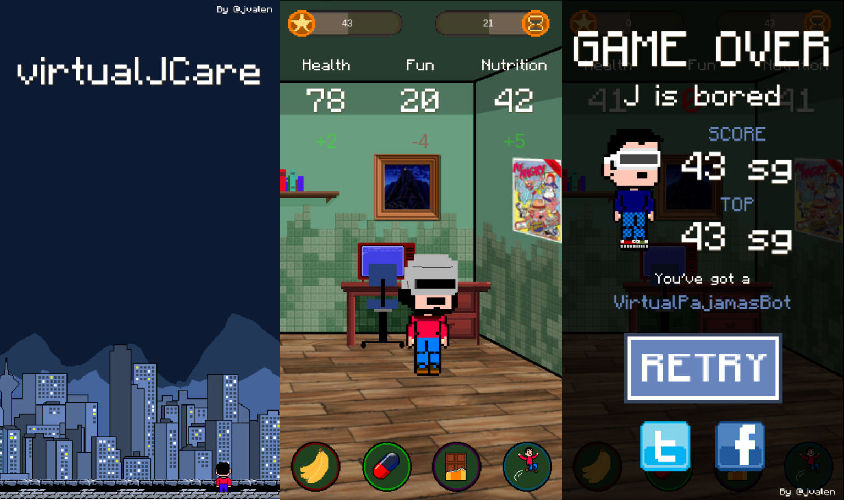

virtualJCare
============

HTML5 mobile game made with [Phaser](https://phaser.io/). **virtualJCare** is an endless carer mobile web game.

Take care of J and enjoy the outfits.

J has three counters (**Health**, **Fun** and **Nutrition**), which are decremented every second. The game ends when one of them reach 0.

To avoid this situation you have 4 buttons, each one of them increase or decrease the counters:
  - Fruit: Good for health and nutrition...not fun though
  - Medicine: Very good for health but not fun or nutritional
  - Chocolate: So much fun
  - Jump: Super funny and healthy

Sometimes J could be hit by rocks which are flying over the room, be very careful!

Enjoy!

### Credits

**Code and graphics** created by [jvalen](http://www.jvrpath.com)

**Main theme** and **intro music** by [Kuja182](https://soundcloud.com/search?q=kuja182)

**Sound effects** picked from [Freesound](www.freesound.org):
  - Aura sound: [Zetauri](https://www.freesound.org/people/Zetauri/)
  - Explosion sound: [plasterbrain](https://www.freesound.org/people/plasterbrain/)
  - Gameover sound: [fins](https://www.freesound.org/people/fins/)
  - Rock sound: [LittleRobotSoundFactory](https://www.freesound.org/people/LittleRobotSoundFactory/)

### Licensing

The code is licensed under MPL 2.0 and graphics are licensed under CC-BY-SA 3.0. Check the **license.txt** file for more detail.
